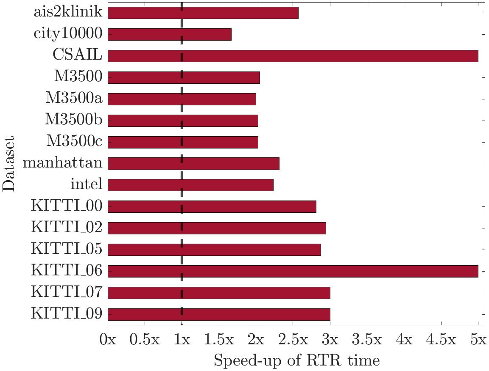

# CPL-Sync

**CPL-Sync** is an *efficient and certifiably correct* algorithm that solves planar pose graph optimization (PGO) using the complex number representation.

This repository features 2 algorithms
- [SE-Sync](https://github.com/david-m-rosen/SE-Sync): a certifiably correct algorithm for performing synchronization over the special Euclidean group.

- CPL-Sync:  a certifiably correct algorithm for performing synchronization over SE(2) using the *complex number representation*.

The performance comparison of  SE-Sync and CPL-Sync on planar PGO is shown as follows:

  

# Getting Started

The C++ implementation of CPL-Sync can be built and exported as a CMake project. For a minimal working example, see [examples/cpl_sync](./C++/examples/cpl_sync.cpp), which provides a simple command-line utility for processing .g2o files.

**It is important to use our provided [Eigen](./Eigen) package to make CPL-Sync work.**

## Copyright and License 

The C++ implementations of CPL-Sync contained herein are copyright (C) 2018 - 2019 by Taosha Fan, and are distributed under the terms of the GNU Lesser General Public License (LGPL) version 3 (or later).  Please see the [LICENSE](./LICENSE) for more information.

Contact: taosha.fan@gmail.com, hanlinwang@u.northwestern.edu
